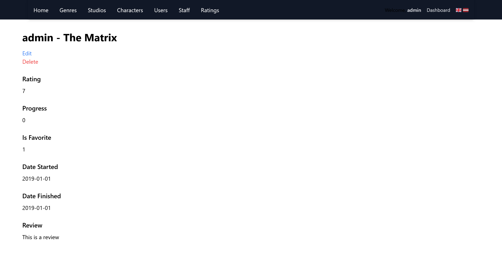

# MyContentList

Movie and TV show rating database

## Table of Contents

-   [About](#about)
-   [Technologies Used](#technologies-used)
-   [Features](#features)
    -   [Guest](#guest)
    -   [User](#user)
    -   [Moderator](#moderator)
    -   [Admin](#admin)
-   [Installation using _Docker_ and _Laravel Sail_ (Tested on Windows 11 with _WSL2_)](#installation-using-docker-and-laravel-sail-tested-on-windows-11-with-wsl2)
    -   [Requirements](#requirements)
    -   [Steps](#steps)
-   [Usage](#usage)
    -   [Default users](#default-users)
-   [Database diagram](#database-diagram)
-   [Screenshots](#screenshots)
    -   [Content list page (English)](#content-list-page-english)
    -   [Content list page (Latvian)](#content-list-page-latvian)
    -   [Content detail page](#content-detail-page)
    -   [Content edit page](#content-edit-page)
    -   [Rating list page](#rating-list-page)
    -   [Rating detail page](#rating-detail-page)
    -   [Rating edit page](#rating-edit-page)
    -   [User list page](#user-list-page)

## About

The web application is a simple movie and TV show rating database. Development process was focused on learning Laravel framework so the design is as bare bones as can be.

## Technologies Used

-   Laravel (Breeze, Sail)
-   MySQL

## Features

-   User authentication and authorization
-   User roles (Admin, Moderator, User and Guest)
-   File upload
-   Language support (English, Latvian)

### Guest

-   View content list and details
-   View ratings list and details
-   View genres, studios, characters, users and staff
-   Switch user interface language
-   Login and register

### User

-   Guest privileges
-   Logout
-   Create, edit and delete owned ratings

### Moderator

-   User privileges
-   Create, edit and delete content

### Admin

-   Moderator privileges
-   Edit and delete all ratings
-   Create, edit and delete genres, studios, characters and staff
-   Add and remove moderator privileges from users

## Installation using _Docker_ and _Laravel Sail_ (Tested on Windows 11 with _WSL2_)

### Requirements

-   Docker

### Steps

1. Clone the repository and navigate to the project directory
2. Install composer dependencies
    ```bash
    docker run --rm \
    -u "$(id -u):$(id -g)" \
    -v "$(pwd):/var/www/html" \
    -w /var/www/html \
    laravelsail/php83-composer:latest \
    composer install --ignore-platform-reqs
    ```
3. Copy the .env.example file to .env
    ```bash
    cp .env.example .env
    ```
4. Start the Laravel Sail containers
    ```bash
    ./vendor/bin/sail up -d
    ```
5. Generate the application key
    ```bash
    ./vendor/bin/sail artisan key:generate
    ```
6. Run the migrations and seed the database
    ```bash
    ./vendor/bin/sail artisan migrate:fresh --seed
    ```
7. Link the storage directory
    ```bash
    ./vendor/bin/sail artisan storage:link
    ```

## Usage

Application can be accessed at <http://localhost>

### Default users

-   Admin
    -   Email: `admin@email.com`
    -   Password: `password`
-   Moderator
    -   Email: `moderator@email.com`
    -   Password: `password`
-   User
    -   Email: `user@email.com`
    -   Password: `password`

## Database diagram


## Screenshots

### Content list page (English)


### Content list page (Latvian)


### Content detail page


### Content edit page


### Rating list page


### Rating detail page



### Rating edit page


### User list page


